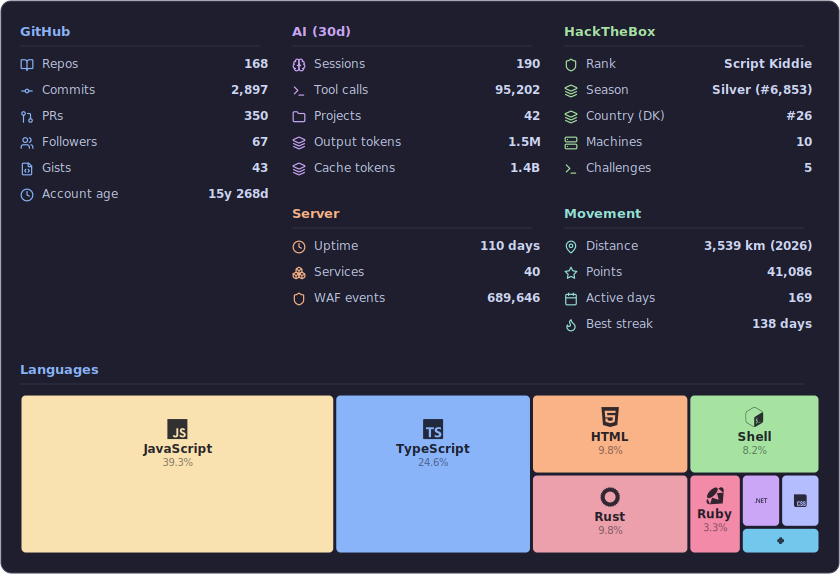

# Allan Kimmer Jensen

Full-stack builder from Copenhagen, Denmark. I split my time between security research and AI agent tooling, with a long history of shipping DevOps infrastructure, browser extensions, game mods, and whatever else catches my interest.

169 public repos. Building at [Remmik](https://github.com/Remmik) & [NORRIQ](https://norriq.com).

---

## Featured projects

### [PromptKiddie](https://github.com/Saturate/PromptKiddie)

A security reconnaissance tool that chains LLM-driven analysis with real scanning tools. Point it at a target and it builds an attack surface map, runs port scans, checks for common vulnerabilities, and writes up findings. Built to make the boring parts of pentesting faster without replacing the human judgment calls.

### [Cartridge](https://github.com/Saturate/cartridge)

A programmable dev container built for AI coding agents. Runs Claude Code, Pi, Codex, Gemini CLI, or any other agent harness inside a single container with built-in tunnels (Cloudflare, Tailscale), MCP servers, and Chromium. Designed to be orchestrated by tools that spawn and manage fleets of agents. Ships with Docker Compose and Helm charts for Kubernetes.

### [mitid-cli](https://github.com/Saturate/mitid-cli)

CLI and Node.js library that hacks Denmark's MitID authentication into the terminal. MitID was designed as a browser-only flow with heavy anti-debugging and anti-automation measures that break Puppeteer, MCP browsers, and similar tools. This reverse-engineers the SRP protocol directly, bypassing the browser entirely. Authenticate from scripts, CI pipelines, and automated tests without fighting their bot detection.

## Open source contributions

| Repository | Description | Stars | PRs | Downloads/mo |
|:-----------|:------------|------:|----:| -----------:|
| [pnpm/pnpm](https://github.com/pnpm/pnpm) | Fast, disk space efficient package manager | 35,833 | 13 |  |
| [pnpm/pacquet](https://github.com/pnpm/pacquet) | The official pnpm rewrite in Rust | 1,164 | 9 |  |
| [puppeteer/puppeteer](https://github.com/puppeteer/puppeteer) | JavaScript API for Chrome and Firefox | 95,329 | 2 |  |
| [npm/npm](https://github.com/npm/npm) | This repository is moving to: https://github.com/npm/cli | 17,628 | 1 |  |
| [jumbocontext/jumbo.cli](https://github.com/jumbocontext/jumbo.cli) | Memory and Context Orchestration for Coding Agents | 265 | 6 | 2,755 |
| [VincentGarreau/particles.js](https://github.com/VincentGarreau/particles.js) | A lightweight JavaScript library for creating particles | 30,230 | 1 | 82,636 |
| [select2/select2](https://github.com/select2/select2) | Select2 is a jQuery based replacement for select boxes. It supports searching... | 25,908 | 1 | 3,082,917 |
| [reddit-archive/reddit](https://github.com/reddit-archive/reddit) | historical code from reddit.com | 16,965 | 1 |  |
| [uxsolutions/bootstrap-datepicker](https://github.com/uxsolutions/bootstrap-datepicker) | A datepicker for twitter bootstrap (@twbs) | 12,650 | 1 | 797,328 |
| [microsoft/winget-pkgs](https://github.com/microsoft/winget-pkgs) | The Microsoft community Windows Package Manager manifest repository | 10,846 | 2 |  |
| [edwardtufte/tufte-css](https://github.com/edwardtufte/tufte-css) | Style your webpage like Edward Tufte’s handouts. | 6,524 | 1 | 1,131 |
| [PathOfBuildingCommunity/PathOfBuilding](https://github.com/PathOfBuildingCommunity/PathOfBuilding) | Offline build planner for Path of Exile. | 5,345 | 1 |  |
| [honestbleeps/Reddit-Enhancement-Suite](https://github.com/honestbleeps/Reddit-Enhancement-Suite) | Reddit Enhancement Suite | 4,485 | 1 |  |
| [PokemonGoF/PokemonGo-Bot](https://github.com/PokemonGoF/PokemonGo-Bot) | The Pokemon Go Bot, baking with community. | 3,904 | 1 |  |
| [pocketjoso/penthouse](https://github.com/pocketjoso/penthouse) | Generate critical css for your web pages | 2,681 | 3 | 166,725 |
| [ctfs/resources](https://github.com/ctfs/resources) | A general collection of information, tools, and tips regarding CTFs and simil... | 1,821 | 1 |  |
| [sindresorhus/gulp-rev](https://github.com/sindresorhus/gulp-rev) | Static asset revisioning by appending content hash to filenames: `unicorn.css... | 1,536 | 1 | 312,405 |
| [jshackles/Enhanced_Steam](https://github.com/jshackles/Enhanced_Steam) | Enhances the Steam Experience | 1,313 | 8 |  |
| [voat/voat](https://github.com/voat/voat) | The code that powers Voat | 1,186 | 1 |  |
| [raskrebs/sonar](https://github.com/raskrebs/sonar) | CLI tool for inspecting and managing services listening on localhost ports | 1,079 | 3 |  |
| [FarmBot/Farmbot-Web-App](https://github.com/FarmBot/Farmbot-Web-App) | Setup, customize, and control FarmBot from any device | 970 | 1 | 80 |
| [skridlevsky/openchaos](https://github.com/skridlevsky/openchaos) | A self-evolving open source project. Every week, the community votes on PRs, ... | 946 | 11 |  |
| [SlexAxton/require-handlebars-plugin](https://github.com/SlexAxton/require-handlebars-plugin) | A plugin for handlebars in require.js (both in dev and build) | 796 | 2 | 8,139 |
| [eugef/node-mocks-http](https://github.com/eugef/node-mocks-http) | Mock 'http' objects for testing Express,js, Next.js and Koa routing functions | 773 | 2 | 8,174,373 |
| [vwall/compass-twitter-bootstrap](https://github.com/vwall/compass-twitter-bootstrap) | The twitter bootstrap ported to compass | 720 | 1 |  |
| [gruntjs/grunt-contrib-jshint](https://github.com/gruntjs/grunt-contrib-jshint) | Validate files with JSHint. | 706 | 1 | 870,371 |
| [sindresorhus/gulp-autoprefixer](https://github.com/sindresorhus/gulp-autoprefixer) | Prefix CSS | 683 | 1 | 885,581 |
| [Mastermindzh/react-cookie-consent](https://github.com/Mastermindzh/react-cookie-consent) | A small, simple and customizable cookie consent bar for use in React applicat... | 638 | 1 | 492,221 |
| [yeoman/generator-backbone](https://github.com/yeoman/generator-backbone) | Scaffold out a Backbone.js project | 636 | 1 | 123 |
| [Rabrennie/anything.js](https://github.com/Rabrennie/anything.js) | A javascript library that contains anything. | 540 | 3 |  |
| [customd/jquery-number](https://github.com/customd/jquery-number) | Easily format numbers for display use. Replace numbers inline in a document, ... | 441 | 1 |  |
| [storybookjs/presets](https://github.com/storybookjs/presets) | 🧩 Presets for Storybook | 424 | 1 |  |
| [jamesshore/object_playground](https://github.com/jamesshore/object_playground) | A tool for visualizing and experimenting with JavaScript object relationships. | 413 | 1 |  |
| [nasa/code-nasa-gov](https://github.com/nasa/code-nasa-gov) | code.nasa.gov site leveraging the Open Source Catalog on github.com, powered ... | 250 | 1 |  |
| [CycloneDX/cyclonedx-rust-cargo](https://github.com/CycloneDX/cyclonedx-rust-cargo) | Creates CycloneDX Software Bill of Materials (SBOM) from Rust (Cargo) projects | 170 | 1 |  |
| [ensingm2/saliengame_idler](https://github.com/ensingm2/saliengame_idler) | A Javascript Idler for the 2018 Steam Summer 'Salien' Minigame | 162 | 2 |  |
| [jfoucher/flickholdr](https://github.com/jfoucher/flickholdr) | Dummy images from flickr, by tags | 126 | 1 |  |
| [tehp/OpenPoGoBot](https://github.com/tehp/OpenPoGoBot) | A PokemonGo Python bot - NO LONGER MAINTAINED | 122 | 1 |  |
| [IanTerzo/Squads](https://github.com/IanTerzo/Squads) | Alternative Microsoft Teams client | 112 | 1 |  |
| [tehp/OpenPoGoWeb](https://github.com/tehp/OpenPoGoWeb) | Web View for OpenPoGoBot | 77 | 2 |  |
| [ada-lovecraft/generator-phaser-official](https://github.com/ada-lovecraft/generator-phaser-official) |  | 73 | 1 | 55 |
| [dependency-check/azuredevops](https://github.com/dependency-check/azuredevops) | Dependency Check Azure DevOps Extension | 53 | 6 |  |
| [geeklearningio/gl-vsts-tasks-yarn](https://github.com/geeklearningio/gl-vsts-tasks-yarn) | Yarn Package Manager Visual Studio Team Services Build and Release Management... | 52 | 1 |  |
| [segment-boneyard/metalsmith-templates](https://github.com/segment-boneyard/metalsmith-templates) | A metalsmith plugin to render files with templates. | 45 | 1 | 2,216 |
| [gulpjs/gulpjs.github.io](https://github.com/gulpjs/gulpjs.github.io) | The gulp website | 44 | 2 |  |
| [PentiaLabs/generator-helix](https://github.com/PentiaLabs/generator-helix) | Generate Helix compliant solutions with Yeoman. | 40 | 13 | 158 |
| [emilstahl/ipv6](https://github.com/emilstahl/ipv6) | IPv6-adresse.dk source & data | 34 | 2 |  |
| [codecansdev/storybook-msw-addon](https://github.com/codecansdev/storybook-msw-addon) | An MSW (Mock Service Worker) addon including a control panel that enables int... | 29 | 1 | 8,511 |
| [licoffe/POE-Stash-indexer](https://github.com/licoffe/POE-Stash-indexer) | A Path of Exile stash indexer for Windows, Mac and Linux | 21 | 2 |  |
| [Thingholm/hvadskaljegstemme.dk](https://github.com/Thingholm/hvadskaljegstemme.dk) |  | 20 | 1 |  |
| [soen/Conjunction](https://github.com/soen/Conjunction) | A Sitecore utility designed to create configurable and personalizable queries... | 13 | 3 | 14 |
| [Codher/pizza.js](https://github.com/Codher/pizza.js) | Learn how to build reactive user interfaces with Vue.js | 4 | 1 |  |
| [axr/extras](https://github.com/axr/extras) | Side projects related to AXR, such as syntax coloring, useful tools, export p... | 4 | 2 |  |
| [galtrold/propeller.mvc](https://github.com/galtrold/propeller.mvc) |  | 2 | 2 |  |
| [PentiaLabs/crust-io](https://github.com/PentiaLabs/crust-io) | Static site generator with support for hiearichal page structure. | 2 | 1 | 87 |
| [dersphere/script.screensaver.nyancat](https://github.com/dersphere/script.screensaver.nyancat) | Just a simple Nyancat/Pop-Tart Cat Screensaver for XBMC | 2 | 1 |  |
| [PentiaLabs/speedtracker](https://github.com/PentiaLabs/speedtracker) | 📉 Visualisation layer and data store for SpeedTracker https://pentialabs.git... | 1 | 1 | 50 |
| [PentiaLabs/Package.Installer](https://github.com/PentiaLabs/Package.Installer) | Package installer npm package | 1 | 1 | 24 |
| [birkestroem/NougatUI](https://github.com/birkestroem/NougatUI) | NodeJS package for Nuget | 1 | 2 |  |
| [BarkAgency/website](https://github.com/BarkAgency/website) | barkagency.dk |  | 10 |  |
| [soen/Sc.StaticAssets](https://github.com/soen/Sc.StaticAssets) |  |  | 1 |  |
| [PentiaLabs/watch.publish.projects](https://github.com/PentiaLabs/watch.publish.projects) | Extending publish-projects to auto publish projects that has changed |  | 1 | 20 |

<!--
Contribution details:

pnpm/pnpm:
  - feat(pacquet-cli): add pacquet sbom command: https://github.com/pnpm/pnpm/pull/12732
  - fix(lockfile): match pnpm's `__` separator for nested peer-group boundaries: https://github.com/pnpm/pnpm/pull/12658
  - feat(sbom): add issue-tracker external reference from package bugs: https://github.com/pnpm/pnpm/pull/12445
  - feat(sbom): add --exclude-peers to omit peer dependencies: https://github.com/pnpm/pnpm/pull/12443
  - feat(sbom): mark devDependency components with CycloneDX scope "excluded": https://github.com/pnpm/pnpm/pull/12442

pnpm/pacquet:
  - feat: lifecycle script execution and allowBuilds policy: https://github.com/pnpm/pacquet/pull/391
  - refactor: extract all inline test modules into dedicated files: https://github.com/pnpm/pacquet/pull/369
  - refactor(cli): extract inline test module into dedicated file: https://github.com/pnpm/pacquet/pull/368
  - refactor(npmrc): extract inline test modules into dedicated files: https://github.com/pnpm/pacquet/pull/367
  - refactor(lockfile): extract inline test modules into dedicated files: https://github.com/pnpm/pacquet/pull/366

puppeteer/puppeteer:
  - Support both HTTP & HTTPS: https://github.com/puppeteer/puppeteer/pull/1372
  - feat: Set default executablePath: https://github.com/puppeteer/puppeteer/pull/1337

npm/npm:
  - Support for noProxy configuration: https://github.com/npm/npm/pull/19157

jumbocontext/jumbo.cli:
  - chore: adopt changesets for release management: https://github.com/jumbocontext/jumbo.cli/pull/181
  - ci: upgrade GitHub Actions to Node.js 22: https://github.com/jumbocontext/jumbo.cli/pull/180
  - refactor(types): replace 62 as-any casts with type-safe event dispatch: https://github.com/jumbocontext/jumbo.cli/pull/140
  - ci: add PR gate workflow for lint, test, and build: https://github.com/jumbocontext/jumbo.cli/pull/138
  - fix(lint): resolve all ESLint errors: https://github.com/jumbocontext/jumbo.cli/pull/137

VincentGarreau/particles.js:
  - Remove deprecated arguments.callee: https://github.com/VincentGarreau/particles.js/pull/194

select2/select2:
  - Added SCSS with Compass as a CSS Preprocessor: https://github.com/select2/select2/pull/547

reddit-archive/reddit:
  - Optimized the picture files in /static/: https://github.com/reddit-archive/reddit/pull/415

uxsolutions/bootstrap-datepicker:
  - Added a Danish Clear Translation: https://github.com/uxsolutions/bootstrap-datepicker/pull/620

microsoft/winget-pkgs:
  - New version: Saturate.Ridgeline version 0.5.0: https://github.com/microsoft/winget-pkgs/pull/380128
  - New package: Saturate.Ridgeline version 0.3.0: https://github.com/microsoft/winget-pkgs/pull/376298

edwardtufte/tufte-css:
  - Optimize all images: https://github.com/edwardtufte/tufte-css/pull/121

PathOfBuildingCommunity/PathOfBuilding:
  - Improve headless mode: implement Inflate/Deflate, NewFileSearch, and path resolution: https://github.com/PathOfBuildingCommunity/PathOfBuilding/pull/9748

honestbleeps/Reddit-Enhancement-Suite:
  - Fix #2785 - support for flic.kr shortlinks: https://github.com/honestbleeps/Reddit-Enhancement-Suite/pull/2790

PokemonGoF/PokemonGo-Bot:
  - Updated the readme with text and format fixes: https://github.com/PokemonGoF/PokemonGo-Bot/pull/823

pocketjoso/penthouse:
  - Bump puppeteer version: https://github.com/pocketjoso/penthouse/pull/234
  -  Use debugjs for debugging: https://github.com/pocketjoso/penthouse/pull/206
  - Update puppeteer: https://github.com/pocketjoso/penthouse/pull/203

ctfs/resources:
  - Fix link to DD on wikipedia: https://github.com/ctfs/resources/pull/20

sindresorhus/gulp-rev:
  - Add `force` option: https://github.com/sindresorhus/gulp-rev/pull/233

jshackles/Enhanced_Steam:
  - Optimize add_badge_view_options(): https://github.com/jshackles/Enhanced_Steam/pull/545
  - Optimize add_badge_view_options(): https://github.com/jshackles/Enhanced_Steam/pull/544
  - Cache `fix_search_placeholder` this: https://github.com/jshackles/Enhanced_Steam/pull/543
  - Format manifest.json: https://github.com/jshackles/Enhanced_Steam/pull/537
  - Replace xpath_each instances with jQuery selectors: https://github.com/jshackles/Enhanced_Steam/pull/529

voat/voat:
  - Optimize Static Graphics: https://github.com/voat/voat/pull/450

raskrebs/sonar:
  - refactor: replace custom contains with strings.Contains: https://github.com/raskrebs/sonar/pull/31
  - ci: add PR check workflow with cross-platform build and tests: https://github.com/raskrebs/sonar/pull/30
  - fix: prevent path traversal in profiles and SSH argument injection: https://github.com/raskrebs/sonar/pull/29

FarmBot/Farmbot-Web-App:
  - Danish translation: https://github.com/FarmBot/Farmbot-Web-App/pull/1203

skridlevsky/openchaos:
  - Post a pic or your PR won't stick: https://github.com/skridlevsky/openchaos/pull/194
  - Add old-age death: PRs take their final breath: https://github.com/skridlevsky/openchaos/pull/185
  - Decimate: Alea Iacta Est, put your PRs to the test: https://github.com/skridlevsky/openchaos/pull/183
  - REWRITE IT IN RUST: because we must: https://github.com/skridlevsky/openchaos/pull/167
  - Fix auto-merge: skip the unmergeable surge: https://github.com/skridlevsky/openchaos/pull/161

SlexAxton/require-handlebars-plugin:
  - Fix Helper documentation: https://github.com/SlexAxton/require-handlebars-plugin/pull/171
  - Make getMetaData return valid JSON: https://github.com/SlexAxton/require-handlebars-plugin/pull/153

eugef/node-mocks-http:
  - Add @types/express to devDependencies: https://github.com/eugef/node-mocks-http/pull/334
  - Replace parseurl with WHATWG URL API: https://github.com/eugef/node-mocks-http/pull/315

vwall/compass-twitter-bootstrap:
  - Fixed Modal Opacity: https://github.com/vwall/compass-twitter-bootstrap/pull/104

gruntjs/grunt-contrib-jshint:
  - Fix `Writing your own JSHint reporter.` link: https://github.com/gruntjs/grunt-contrib-jshint/pull/109

sindresorhus/gulp-autoprefixer:
  - Fix #55, issue with sourcemap output: https://github.com/sindresorhus/gulp-autoprefixer/pull/61

Mastermindzh/react-cookie-consent:
  - Add TypeScript Definition: https://github.com/Mastermindzh/react-cookie-consent/pull/29

yeoman/generator-backbone:
  - Update  'grunt-contrib-jshint': https://github.com/yeoman/generator-backbone/pull/158

Rabrennie/anything.js:
  - Get awesome people: https://github.com/Rabrennie/anything.js/pull/251
  - MADE A SHOUT FUNCTION, REALLY USEFUL. BITCH!!!!: https://github.com/Rabrennie/anything.js/pull/249
  - Implement a GUID function: https://github.com/Rabrennie/anything.js/pull/248

customd/jquery-number:
  - Fix for issue #14: https://github.com/customd/jquery-number/pull/15

storybookjs/presets:
  - Add syntax language highlighting for code block: https://github.com/storybookjs/presets/pull/264

jamesshore/object_playground:
  - Quick and basic layout: https://github.com/jamesshore/object_playground/pull/3

nasa/code-nasa-gov:
  - Add link to code.nasa.gov: https://github.com/nasa/code-nasa-gov/pull/8

CycloneDX/cyclonedx-rust-cargo:
  - Add CycloneDX spec version 1.6 and 1.7 support: https://github.com/CycloneDX/cyclonedx-rust-cargo/pull/872

ensingm2/saliengame_idler:
  - GUI Updated, Estimated time to next level: https://github.com/ensingm2/saliengame_idler/pull/16
  - Add very basic bot gui: https://github.com/ensingm2/saliengame_idler/pull/14

jfoucher/flickholdr:
  - Optimized some assets file size: https://github.com/jfoucher/flickholdr/pull/1

tehp/OpenPoGoBot:
  - Updated flags, and fixed minor syntax errors.: https://github.com/tehp/OpenPoGoBot/pull/154

IanTerzo/Squads:
  - Handle expired refresh token gracefully: https://github.com/IanTerzo/Squads/pull/28

tehp/OpenPoGoWeb:
  - Homedrawn pokeball favicon: https://github.com/tehp/OpenPoGoWeb/pull/82
  - Fixed markdown format for README.md: https://github.com/tehp/OpenPoGoWeb/pull/76

ada-lovecraft/generator-phaser-official:
  - Add `yeoman-generator` keyword: https://github.com/ada-lovecraft/generator-phaser-official/pull/2

dependency-check/azuredevops:
  - ci: migrate from Azure Pipelines to GitHub Actions: https://github.com/dependency-check/azuredevops/pull/196
  - feat: Remove old nodejs versions: https://github.com/dependency-check/azuredevops/pull/185
  - Update README.md: https://github.com/dependency-check/azuredevops/pull/182
  - Update README.md: https://github.com/dependency-check/azuredevops/pull/150
  - Github issue templates: https://github.com/dependency-check/azuredevops/pull/148

geeklearningio/gl-vsts-tasks-yarn:
  - Fix minor Markdown syntax error: https://github.com/geeklearningio/gl-vsts-tasks-yarn/pull/14

segment-boneyard/metalsmith-templates:
  - Update Readme.md: https://github.com/segment-boneyard/metalsmith-templates/pull/49

gulpjs/gulpjs.github.io:
  - Contribute section with backers and sponsors: https://github.com/gulpjs/gulpjs.github.io/pull/60
  - Add README.md: https://github.com/gulpjs/gulpjs.github.io/pull/59

PentiaLabs/generator-helix:
  - Update readme formatting: https://github.com/PentiaLabs/generator-helix/pull/114
  - Fix #94 - Powershell path issue: https://github.com/PentiaLabs/generator-helix/pull/98
  - Test NodeJS LTS & Stable, both on x86 and x64: https://github.com/PentiaLabs/generator-helix/pull/95
  - Update dependencies: https://github.com/PentiaLabs/generator-helix/pull/93
  - Eslint checking: https://github.com/PentiaLabs/generator-helix/pull/87

emilstahl/ipv6:
  - Move detection to JavaScript: https://github.com/emilstahl/ipv6/pull/9
  - Add a newer YouSee source: https://github.com/emilstahl/ipv6/pull/8

codecansdev/storybook-msw-addon:
  - Update README.md Usage Example: https://github.com/codecansdev/storybook-msw-addon/pull/10

licoffe/POE-Stash-indexer:
  - 	No more MongoDB index pyramid of doom : https://github.com/licoffe/POE-Stash-indexer/pull/5
  - Create .gitignore: https://github.com/licoffe/POE-Stash-indexer/pull/3

Thingholm/hvadskaljegstemme.dk:
  - Migrering af frontend fra Vite/TanStack til Next.js 16: https://github.com/Thingholm/hvadskaljegstemme.dk/pull/22

soen/Conjunction:
  - Add Branding: https://github.com/soen/Conjunction/pull/13
  - Add build badge: https://github.com/soen/Conjunction/pull/12
  - Add configuration for CI: https://github.com/soen/Conjunction/pull/11

Codher/pizza.js:
  - Fix minor text mistakes: https://github.com/Codher/pizza.js/pull/1

axr/extras:
  - Added some Auto Completion to the Coda Bundle: https://github.com/axr/extras/pull/3
  - Added a Coda Syntc Highlighter: https://github.com/axr/extras/pull/2

galtrold/propeller.mvc:
  - Create appveyor.yml: https://github.com/galtrold/propeller.mvc/pull/2
  - Add Travis CI integration: https://github.com/galtrold/propeller.mvc/pull/1

PentiaLabs/crust-io:
  - Better debugging by throwing error objs, windows path support: https://github.com/PentiaLabs/crust-io/pull/1

dersphere/script.screensaver.nyancat:
  - Added a Danish translation: https://github.com/dersphere/script.screensaver.nyancat/pull/2

PentiaLabs/speedtracker:
  - Merge in changes: https://github.com/PentiaLabs/speedtracker/pull/1

PentiaLabs/Package.Installer:
  - Update dependencies, add build step and ESLint test: https://github.com/PentiaLabs/Package.Installer/pull/4

birkestroem/NougatUI:
  - Update readme: https://github.com/birkestroem/NougatUI/pull/3
  - Moved dependencies to root: https://github.com/birkestroem/NougatUI/pull/1

BarkAgency/website:
  - add coachdp: https://github.com/BarkAgency/website/pull/15
  - fix indexes: https://github.com/BarkAgency/website/pull/14
  - remove zrool: https://github.com/BarkAgency/website/pull/13
  - Update 404.tsx: https://github.com/BarkAgency/website/pull/12
  - Update index.tsx: https://github.com/BarkAgency/website/pull/11

soen/Sc.StaticAssets:
  - Fix minor spelling error: https://github.com/soen/Sc.StaticAssets/pull/1

PentiaLabs/watch.publish.projects:
  - Minor cleanup of code and readme: https://github.com/PentiaLabs/watch.publish.projects/pull/1
-->

## Stats

  

---

Generated by [generate.mjs](./generate.mjs) on 2026-07-21
